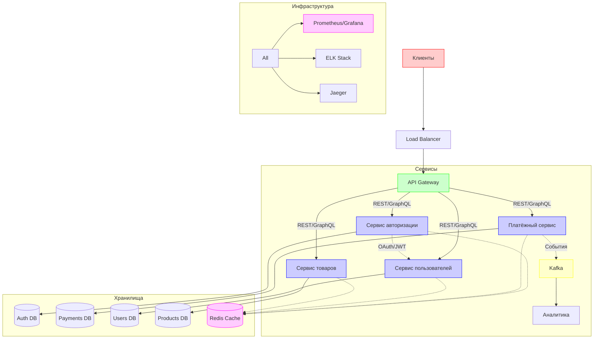

  

# Пономарев Алексей

  
  

## 💻 Технический стек

<table>
  <tr>
    <td width="50%">
      <table>
        <tr>
          <td>Языки</td>
          <td>
            
            
            
            
          </td>
        </tr>
        <tr>
          <td>Фреймворки</td>
          <td>
            
            
            
            
          </td>
        </tr>
        <tr>
          <td>Базы данных</td>
          <td>
             
            
            
            
          </td>
        </tr>
        <tr>
          <td>DevOps</td>
          <td>
            
            
            
            
          </td>
        </tr>
      </table>
    </td>
    <td width="50%">
      
    </td>
  </tr>
</table>

## 📈 Показатели работы

  

    
    
  

## 🚀 Реализованные проекты

  <table>
    <tr>
      <td align="center" width="33%">
        
         
        <b>Финансовая платформа</b>
         
        <small>1M+ транзакций/день</small>
        

        
        
      </td>
      <td align="center" width="33%">
        
         
        <b>E-commerce API</b>
         
        <small>500K+ пользователей</small>
        

        
        
      </td>
      <td align="center" width="33%">
        
         
        <b>Микросервисная архитектура</b>
         
        <small>Снижение нагрузки на 75%</small>
        

        
        
      </td>
    </tr>
  </table>

## 🏆 Развёрнутая архитектура

  

## 📊 Достижения в цифрах

  <table>
    <tr>
      <td align="center">
        
         
        <b>Сокращение времени ответа</b>
        <h2>75%</h2>
      </td>
      <td align="center">
        
         
        <b>Оптимизация затрат на сервера</b>
        <h2>40%</h2>
      </td>
      <td align="center">
        
         
        <b>Увеличение пропускной способности</b>
        <h2>10x</h2>
      </td>
      <td align="center">
        
         
        <b>Open-source вклады</b>
        <h2>25+</h2>
      </td>
    </tr>
  </table>

## 📫 Связаться

  

  

